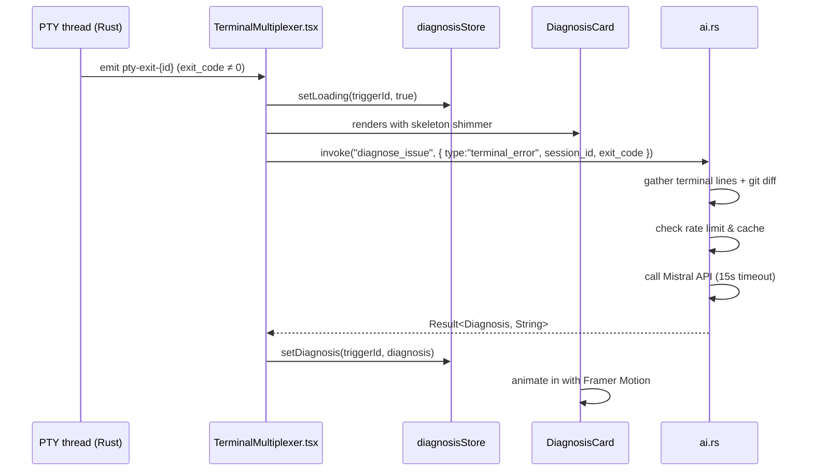
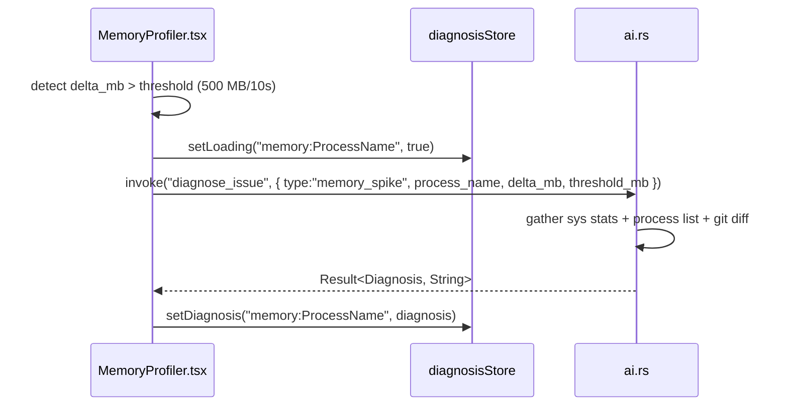
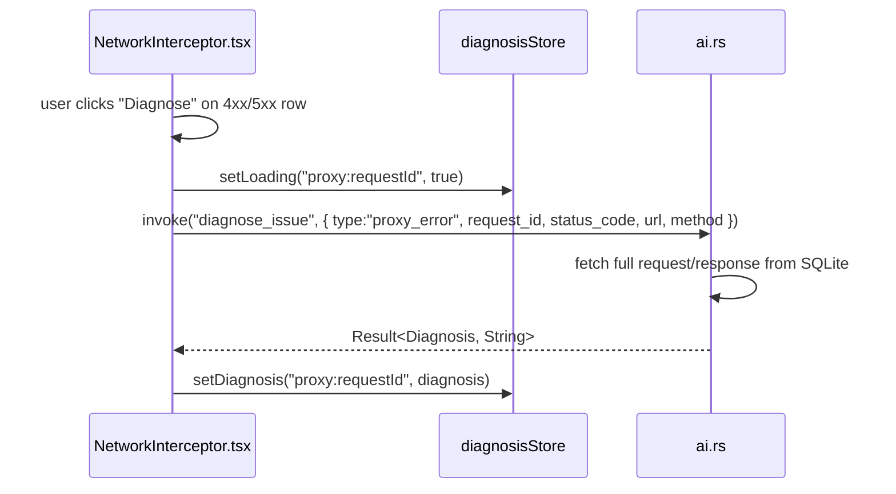

# Design Document: AI Root-Cause Copilot

## Overview

When a terminal command exits with a non-zero code, memory usage spikes past a threshold, or a proxied HTTP request returns a 4xx/5xx, the AI Root-Cause Copilot automatically collects context from the relevant CodexOS modules, sends it to the Mistral API (`mistral-large-latest`), and renders a dismissible glassmorphic diagnosis card — not a chat window. The feature is entirely opt-in: if no `MISTRAL_API_KEY` is stored in the Secrets vault, the feature stays silent except for a small hint in Settings.

The Rust backend (`src-tauri/src/ai.rs`) is already fully implemented. This design documents both what exists and what the frontend must implement to complete the feature.

---

## Architecture

```mermaid
graph TD
    subgraph Trigger Sources
        T[TerminalMultiplexer<br/>PTY exit ≠ 0]
        M[MemoryProfiler<br/>delta > threshold]
        N[NetworkInterceptor<br/>Diagnose button<br/>on 4xx/5xx]
    end

    subgraph Frontend
        T -->|invoke diagnose_issue| IPC
        M -->|invoke diagnose_issue| IPC
        N -->|invoke diagnose_issue| IPC
        IPC --> DS[diagnosisStore<br/>Zustand slice]
        DS --> DC[DiagnosisCard.tsx<br/>glassmorphic overlay]
    end

    subgraph Rust Backend — ai.rs
        IPC --> RLC[DiagnosticTrigger enum]
        RLC --> CG[Context Gatherer<br/>multiplexer / git / sys / proxy]
        CG --> RateLimit[Rate Limiter<br/>1 req / 10s / trigger type]
        RateLimit --> Cache[In-memory cache<br/>keyed by session/request id]
        Cache -->|miss| Mistral[Mistral API<br/>mistral-large-latest<br/>15 s timeout]
        Mistral --> Parse[JSON parser<br/>strips markdown fences]
        Parse --> Cache
        Cache --> IPC
    end

    subgraph Secrets
        SecretsVault[(Secrets Vault<br/>ChaCha20-Poly1305)] -->|MISTRAL_API_KEY| Mistral
    end
```

---

## Sequence Diagrams

### Terminal Error Flow



### Memory Spike Flow



### Network Error Flow (Manual)



---

## Components and Interfaces

### Component: DiagnosisCard.tsx

**Purpose**: Renders the diagnosis result as a floating, dismissible glassmorphic card anchored to the bottom-right of the active module.

**Props interface**:
```typescript
interface DiagnosisCardProps {
  triggerId: string        // used to look up store state and dismiss
  onNavigateToFile?: (path: string) => void  // opens path in File Vault
}
```

**Visual states**:
- Loading → skeleton shimmer (3 rows: wide, medium, narrow) using Framer Motion
- Success → cause headline + confidence badge + collapsible explanation + fix block + file chips
- Error → "Diagnosis unavailable — [reason]" with retry button
- Dismissed → null render (state persisted in diagnosisStore)

**Confidence badge colors** (matches existing CodexOS severity palette):
- `high` → `bg-red-500/20 text-red-400 border-red-500/30`
- `medium` → `bg-amber-500/20 text-amber-400 border-amber-500/30`
- `low` → `bg-gray-500/20 text-gray-400 border-gray-500/30`

### Store: diagnosisStore.ts

**Purpose**: New Zustand slice tracking active diagnoses, loading states, and dismissed trigger IDs.

```typescript
interface DiagnosisEntry {
  status: 'loading' | 'success' | 'error'
  diagnosis?: Diagnosis           // matches Rust Diagnosis struct
  errorMessage?: string
  triggerId: string
}

interface DiagnosisState {
  entries: Record<string, DiagnosisEntry>  // keyed by triggerId
  dismissedIds: Set<string>
  enabled: boolean                          // AI Copilot on/off setting

  setLoading: (triggerId: string) => void
  setDiagnosis: (triggerId: string, d: Diagnosis) => void
  setError: (triggerId: string, msg: string) => void
  dismiss: (triggerId: string) => void
  setEnabled: (v: boolean) => void
}

interface Diagnosis {
  cause: string
  confidence: 'high' | 'medium' | 'low'
  explanation: string
  suggested_fix: string
  related_files: string[]
}
```

### Settings Integration

New section in `SettingsPage.tsx`: "AI Root-Cause Copilot"
- Toggle: `enabled` (routes to `diagnosisStore.setEnabled`)
- Status indicator: green chip "API Key Configured" or amber link "Set up API Key →" (navigates to Secrets tab)
- Spike threshold input: `memorySpikeMb` (default 500) stored in Zustand settings
- Spike window input: `memorySpikeWindowSec` (default 10) stored in Zustand settings

---

## Data Models

### DiagnosticTrigger (mirrors Rust enum — sent via Tauri invoke)

```typescript
type DiagnosticTrigger =
  | { type: 'terminal_error'; session_id: string; exit_code: number; last_n_lines?: number }
  | { type: 'memory_spike';   process_name: string; delta_mb: number; threshold_mb: number }
  | { type: 'proxy_error';    request_id: number; status_code: number; url: string; method: string }
```

### Diagnosis (mirrors Rust struct — returned from Tauri invoke)

```typescript
interface Diagnosis {
  cause: string
  confidence: 'high' | 'medium' | 'low'
  explanation: string
  suggested_fix: string
  related_files: string[]
}
```

### Settings additions to existing Zustand store

```typescript
// Extend existing DashboardState.settings with:
aiCopilotEnabled: boolean          // default: true
memorySpikeThresholdMb: number     // default: 500
memorySpikeWindowSec: number       // default: 10
```

---

## Key Functions with Formal Specifications

### diagnose_issue (Rust — already implemented in ai.rs)

```rust
pub async fn diagnose_issue(
    trigger: DiagnosticTrigger,
    repo_path: Option<String>,
    secrets_state: State<'_, SecretsState>,
    pty_state: State<'_, MultiPtyState>,
    sys_state: State<'_, SysState>,
    diagnosis_state: State<'_, DiagnosisState>,
    app: AppHandle,
) -> Result<Diagnosis, String>
```

**Preconditions:**
- `MISTRAL_API_KEY` must exist in the unlocked Secrets vault; otherwise returns `Err` immediately
- `trigger` must be a valid `DiagnosticTrigger` variant
- At most 1 outstanding request per `TriggerKind` per 10-second window

**Postconditions:**
- On success: returns `Diagnosis` with non-empty `cause`, `confidence` ∈ {"high","medium","low"}, non-empty `explanation` and `suggested_fix`
- On cache hit: returns same `Diagnosis` without calling Mistral API
- On rate-limit: returns `Err("Rate limited — please wait N seconds...")`
- On API failure: returns `Err` with descriptive message; no partial state mutation
- API key is never logged or forwarded to the frontend

**Loop invariant (context truncation loop):**
- After each iteration, `total` strictly decreases by at least 1 byte; loop terminates when `total ≤ MAX_CONTEXT_CHARS` or terminal buffer has ≤ 1 line

### triggerTerminalDiagnosis (Frontend — to be implemented)

```typescript
async function triggerTerminalDiagnosis(
  sessionId: string,
  exitCode: number,
  store: DiagnosisStore,
  repoPath: string | null,
): Promise<void>
```

**Preconditions:**
- `exitCode !== 0`
- `store.enabled === true`
- trigger ID `"terminal:" + sessionId` is not in `store.dismissedIds`

**Postconditions:**
- `store.entries["terminal:" + sessionId]` transitions: absent → loading → success | error
- On success: `DiagnosisCard` renders with the returned `Diagnosis`
- On error: `DiagnosisCard` renders error state with retry button
- Fire-and-forget from `TerminalPane`'s perspective (no await in caller)

### triggerMemoryDiagnosis (Frontend — to be implemented)

```typescript
async function triggerMemoryDiagnosis(
  processName: string,
  deltaMb: number,
  thresholdMb: number,
  store: DiagnosisStore,
  repoPath: string | null,
): Promise<void>
```

**Preconditions:**
- `deltaMb >= thresholdMb`
- `store.enabled === true`
- Not already loading for the same `processName`

**Postconditions:**
- Same loading → success | error transition in store
- Only fires once per 10-second window per process name (debounced in frontend; backend also rate-limits)

---

## Algorithmic Pseudocode

### DiagnosisCard render algorithm

```pascal
PROCEDURE renderDiagnosisCard(triggerId)
  INPUT: triggerId of type string
  OUTPUT: React element or null

  entry ← diagnosisStore.entries[triggerId]

  IF triggerId IN diagnosisStore.dismissedIds THEN
    RETURN null
  END IF

  IF entry IS NULL THEN
    RETURN null
  END IF

  IF entry.status = "loading" THEN
    RETURN SkeletonCard()
  END IF

  IF entry.status = "error" THEN
    RETURN ErrorCard(entry.errorMessage, onRetry)
  END IF

  // entry.status = "success"
  diagnosis ← entry.diagnosis

  badge ← confidenceBadge(diagnosis.confidence)
  // high → red, medium → amber, low → gray

  RETURN
    GlassCard(
      Header(diagnosis.cause, badge, DismissButton(triggerId)),
      CollapsibleSection("Explanation", diagnosis.explanation),
      MonoBlock("Suggested Fix", diagnosis.suggested_fix),
      FileChips(diagnosis.related_files, onNavigateToFile)
    )
END PROCEDURE
```

### Memory spike detection algorithm

```pascal
PROCEDURE detectMemorySpike(processName, currentMemMb, settings)
  INPUT: processName (string), currentMemMb (float), settings (store)
  OUTPUT: shouldTrigger (boolean)

  // Maintain rolling window in component state
  window ← memoryWindow[processName]  // deque of (timestamp, memMb) pairs

  now ← Date.now()
  windowStart ← now - (settings.memorySpikeWindowSec * 1000)

  // Evict expired entries
  WHILE window.front.timestamp < windowStart DO
    window.popFront()
  END WHILE

  window.pushBack({ timestamp: now, memMb: currentMemMb })

  IF window.size < 2 THEN
    RETURN false
  END IF

  delta ← window.back.memMb - window.front.memMb

  IF delta >= settings.memorySpikeThresholdMb THEN
    RETURN true
  END IF

  RETURN false
END PROCEDURE
```

### JSON fence-stripping and re-parse (Rust — already implemented)

```pascal
PROCEDURE parseDiagnosisJson(raw)
  INPUT: raw (string from Mistral)
  OUTPUT: Diagnosis or Error

  // First attempt: direct parse
  IF tryParse(raw) SUCCEEDS THEN
    RETURN diagnosis
  END IF

  // Strip markdown fences (one attempt only)
  cleaned ← raw
    .trim()
    .stripPrefix("```json")
    .stripPrefix("```")
    .stripSuffix("```")
    .trim()

  IF tryParse(cleaned) SUCCEEDS THEN
    RETURN diagnosis
  END IF

  RETURN Error("Invalid response format: " + parseError)
END PROCEDURE
```

---

## Example Usage

### Wiring TerminalPane to trigger diagnosis

```typescript
// Inside TerminalPane useEffect, after PTY exit event:
const unlistenExit = await listen<number>(`pty-exit-${id}`, (event) => {
  const exitCode = event.payload;
  if (exitCode !== 0 && diagnosisStore.enabled) {
    const triggerId = `terminal:${id}`;
    diagnosisStore.setLoading(triggerId);
    invoke<Diagnosis>('diagnose_issue', {
      trigger: { type: 'terminal_error', session_id: id, exit_code: exitCode },
      repoPath: currentPath ?? null,
    })
      .then(d => diagnosisStore.setDiagnosis(triggerId, d))
      .catch(e => diagnosisStore.setError(triggerId, String(e)));
  }
});
```

### DiagnosisCard skeleton shimmer

```typescript
// Loading state — matches Framer Motion patterns in existing components
<motion.div
  initial={{ opacity: 0, y: 10 }}
  animate={{ opacity: 1, y: 0 }}
  className="bg-black/60 backdrop-blur-xl border border-white/10 rounded-2xl p-5 space-y-3"
>
  {[['100%', 'h-4'], ['75%', 'h-3'], ['50%', 'h-3']].map(([w, h], i) => (
    <div key={i} className={`${h} rounded bg-white/5 animate-pulse`} style={{ width: w }} />
  ))}
</motion.div>
```

### Diagnose button in NetworkInterceptor row

```typescript
// Added to each row where response_status >= 400:
{req.response_status >= 400 && (
  <button
    onClick={() => {
      const triggerId = `proxy:${req.id}`;
      diagnosisStore.setLoading(triggerId);
      invoke<Diagnosis>('diagnose_issue', {
        trigger: {
          type: 'proxy_error',
          request_id: req.id,
          status_code: req.response_status,
          url: req.url,
          method: req.method,
        },
        repoPath: null,
      })
        .then(d => diagnosisStore.setDiagnosis(triggerId, d))
        .catch(e => diagnosisStore.setError(triggerId, String(e)));
    }}
    className="px-2 py-1 text-[10px] font-bold rounded bg-violet-500/20 text-violet-400 hover:bg-violet-500/30 border border-violet-500/30"
  >
    Diagnose
  </button>
)}
```

---

## Correctness Properties

### P1 — API key isolation
For all invocations of `diagnose_issue`, the `MISTRAL_API_KEY` value is never serialized into a Tauri event, never returned in a `Result`, and never appears in logs. The key flows exclusively as an `Authorization` header value inside the Rust process.

**Validates: Requirements 11.1, 11.2, 11.3**

### P2 — Silent disable
If `get_secret_internal(secrets_state, "MISTRAL_API_KEY")` returns `None`, `diagnose_issue` returns `Err(...)` immediately. No network request is made. The frontend surfaces this as a disabled feature with a settings hint, not an error toast.

**Validates: Requirements 1.1, 1.2, 1.3**

### P3 — Cache correctness
For any fixed `(session_id, exit_code)` pair, repeated invocations of `diagnose_issue` with the same `TerminalError` trigger return the same `Diagnosis` without calling the Mistral API after the first successful call. Cache is invalidated only by process restart.

**Validates: Requirements 7.1, 7.2, 7.3, 7.4**

### P4 — Rate limit enforcement
For any trigger kind K, if two `diagnose_issue` calls with kind K arrive within 10 seconds of each other, the second returns `Err("Rate limited...")`. The clock is measured by `Instant::elapsed()` on the Rust side; the frontend must not assume its own debounce is sufficient.

**Validates: Requirements 8.1, 8.2, 8.3**

### P5 — Context budget
The total character count of the assembled context prompt never exceeds `MAX_CONTEXT_CHARS` (16,000 chars ≈ 4,000 tokens). Terminal lines are truncated oldest-first; all other sections are included verbatim unless their individual preview cap (git diff: 8,000 chars, response body: 2,000 chars) triggers first.

**Validates: Requirements 9.1, 9.2, 9.3, 9.4**

### P6 — Dismiss persistence
Once `dismiss(triggerId)` is called, `DiagnosisCard` renders `null` for that `triggerId` for the lifetime of the session. `dismissedIds` is stored in the Zustand slice (session memory only — intentionally not persisted to localStorage).

**Validates: Requirements 5.4, 5.5, 5.7, 6.4**

### P7 — Fire-and-forget isolation
Triggering a diagnosis call must not block, throw, or affect the render cycle of the originating component (`TerminalPane`, `MemoryProfiler`, `NetworkInterceptor`). All state changes flow through `diagnosisStore`.

**Validates: Requirements 2.4, 3.4, 4.3**

---

## Error Handling

### No API key
- Condition: vault locked or `MISTRAL_API_KEY` not present
- Response: `diagnose_issue` returns `Err(...)`, frontend does nothing (feature disabled)
- Recovery: user adds key via Secrets tab, or via Settings AI Copilot section hint link

### API timeout (15 s)
- Condition: Mistral API does not respond within 15 seconds
- Response: `Err("Request timed out after 15 seconds")` → `DiagnosisCard` shows error state
- Recovery: retry button in card re-invokes `diagnose_issue`; cache miss means a fresh API call

### API rate limit (HTTP 429)
- Condition: Mistral returns 429
- Response: `Err("Rate limited by Mistral API")` → card shows error with retry
- Recovery: user retries manually after a delay

### Malformed JSON response
- Condition: Mistral returns non-JSON or JSON wrapped in markdown fences
- Response: fence-stripping attempted once; if still invalid, `Err("Invalid response format: ...")`
- Recovery: card shows error state with retry

### Memory spike false positive
- Condition: short burst of memory usage that self-resolves before card is dismissed
- Response: card is already shown with the diagnosis; user dismisses it
- Recovery: dismiss button clears the card; next spike detection window resets

---

## Testing Strategy

### Unit Testing

- `parseDiagnosisJson`: test direct JSON, fenced JSON, double-fenced, invalid → verify parse or error
- `ContextBundle.to_prompt`: verify total char count never exceeds `MAX_CONTEXT_CHARS` regardless of input size
- `cache_key`: verify distinct triggers produce distinct keys, same trigger produces same key
- `DiagnosisCard`: render loading/success/error/dismissed states with React Testing Library

### Property-Based Testing

**Property test library**: fast-check (frontend) / proptest (Rust)

- For any `ContextBundle` with sections of arbitrary total size > `MAX_CONTEXT_CHARS`, `to_prompt()` always returns a string of length ≤ `MAX_CONTEXT_CHARS`
- For any `DiagnosticTrigger`, `cache_key(trigger)` is a deterministic pure function of the trigger's fields
- For any sequence of `dismiss(id)` calls, the `dismissedIds` set only ever grows (monotone)

### Integration Testing

- Mock Mistral API (MSW or Rust mock server): verify full round-trip `invoke("diagnose_issue") → parse → store → card render`
- Tauri command registration: verify `diagnose_issue` and `is_copilot_configured` are present in `lib.rs` invoke handler list
- Settings toggle: verify `aiCopilotEnabled = false` prevents `invoke("diagnose_issue")` from being called

---

## Performance Considerations

- Context assembly is synchronous Rust but bounded by `MAX_CONTEXT_CHARS`; no file I/O beyond git diff (already cached by git2)
- Mistral API call is fully async on a Tokio thread; the Tauri main thread is never blocked
- Frontend diagnosis invocations are fire-and-forget; no `await` in event handlers
- `DiagnosisCard` unmounts cleanly on dismiss — no subscription leaks
- Memory spike window is a simple deque maintained in React state; O(n) where n = samples in 10s window ≈ 5 at 2s poll interval

---

## Security Considerations

- `MISTRAL_API_KEY` stored in ChaCha20-Poly1305 encrypted vault on disk; never in localStorage, never in Tauri events, never in JS bundle
- `get_secret_internal` is a Rust-only function (`pub` within crate, not a `#[tauri::command]`) — the frontend cannot read secret values
- Context sent to Mistral contains only: terminal output, git diff, memory/process stats, HTTP request/response. No file contents, no other secrets
- Git diff is capped at 8,000 chars to avoid accidentally sending large credential or config file changes
- `related_files` field returned by Mistral is display-only; files are opened via the existing File Vault navigation — no arbitrary file execution

---

## Dependencies

### Rust (all already present in Cargo.toml)
- `reqwest` with `tokio` — async HTTP client for Mistral API
- `serde` / `serde_json` — serialization of request/response structs
- `git2` — recent commit diff via `get_recent_commit_diff_internal`
- `sysinfo` — memory/process stats
- `tauri` — command registration, `State<>` injection

### Frontend (all already present in package.json)
- `zustand` ^5 — new `diagnosisStore` slice
- `framer-motion` ^12 — card enter/exit animations, skeleton shimmer
- `@tauri-apps/api` — `invoke` for `diagnose_issue` and `is_copilot_configured`
- `lucide-react` — icons (X for dismiss, AlertTriangle for error state, Sparkles for header)
- `tailwindcss` — glassmorphic utility classes matching existing component palette
