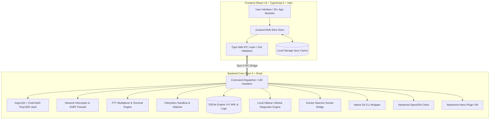

<div align="center">
  
  
  # CodexOS Architecture Guide
</div>

This document details the architectural blueprints, subsystem boundaries, data durability guarantees, and security threat model of **CodexOS**.

---

## 1. System Architecture Overview



---

## 2. Layer Responsibilities

### 2.1 Presentation & State Layer (Frontend)
- **Framework**: React 19 with Vite, Tailwind CSS (v4), and Framer Motion.
- **Routing**: Lightweight dynamic lazy-loaded module router (`src/components/layout/AppRouter.tsx`).
- **State Management**: Zustand partitioned into domain slices:
  - `tabsSlice.ts`: Tab navigation, path history, and workspace context.
  - `settingsSlice.ts`: App settings, theme, terminal shell, and copilot config.
  - `uiSlice.ts`: Toast notification system and dialog states.
  - `diagnosisStore.ts`: Real-time AI diagnostic state and root-cause cache.
- **Data Durability**: Dual-write strategy featuring synchronous in-memory state with immediate `localStorage` caching and asynchronous SQLite WAL key-value persistence via `kv_set` / `kv_get`.

### 2.2 IPC & Data Validation Layer
- **Type Safety**: Rust structs derive `serde::Serialize` / `serde::Deserialize`.
- **Runtime Validation**: `src/ipc.ts` parses incoming IPC responses through strict **Zod** schemas (`SysStatsSchema`, `GitStatusSchema`, `DiagnosisSchema`, `DockerContainerSummarySchema`). This protects the frontend from silent contract drift and invalid payloads. See [ADR 004](./docs/adr/004-ipc-zod-validation.md).

### 2.3 Backend Subsystems (Rust Engine)
- **Security & Cryptography (`secrets.rs`, `vault.rs`, `hmac_vault.rs`)**:
  - Argon2id key derivation with versioned parameters ($m=64\text{MB}$, $t=3$, $p=1$, minimum 12-character passphrase).
  - Authenticated symmetric encryption using ChaCha20-Poly1305 with AES-256-GCM fallback.
  - Memory-safe master key management using `zeroize::Zeroizing<Vec<u8>>`.
  - Rate-limited brute-force lockout with SQLite persistence.
  - HMAC-SHA256 commitment proofs with constant-time verification.
- **Key-Value Persistence Engine (`kv.rs`)**:
  - Decoupled SQLite persistence subsystem for tab sessions and application settings.
  - SQLite WAL (Write-Ahead Logging) mode and `synchronous=NORMAL` for maximum concurrent throughput.
- **Shared Utilities & LRU Cache (`util.rs`)**:
  - Centralized `lock_poison_recover` helper preventing thread poisoning crashes across all Mutex states.
  - Deterministic `BoundedLruCache` powering AI diagnosis cache eviction (max 100 entries).
- **Network Interception & SSRF Firewall (`proxy.rs`)**:
  - Built-in HTTP/HTTPS intercepting proxy on loopback using Hyper.
  - Strict SSRF protection blocking private RFC-1918 ranges, loopback (`127.0.0.0/8`, `::1`), CGNAT (`100.64.0.0/10`), IPv6 ULA/link-local, and cloud metadata endpoints (`169.254.169.254`, `metadata.google.internal`).
  - Panic-free SQLite storage with bounded log auto-eviction (capped at 500 recent records).
- **AI Diagnostic Engine (`ai.rs`)**:
  - Root-cause diagnostics combining PTY terminal logs, git diffs, process memory spikes, and network errors.
  - Token-budgeted context formatting (`MAX_CONTEXT_CHARS = 16,000`) and rate-limited API calls (1 per 10s).
- **PTY Terminal Multiplexer (`multiplexer.rs`)**:
  - Cross-platform pseudoterminal management via `portable-pty`.
  - Bidirectional streaming between backend PTY channels and frontend xterm.js instances with bounded circular buffers (`MAX_BUFFER_LINES = 200`).
- **Filesystem Sandbox (`files.rs`, `fs_cache.rs`)**:
  - `AllowedPathsState` enforcing path traversal boundaries and explicit workspace allowlists.
  - Poison-resilient file system watching via `notify`.
  - Asynchronous background execution using `tokio::task::spawn_blocking` for high-throughput scans, bloat detection, and metric aggregation.
- **Git & SSH Subsystems (`git.rs`, `ssh.rs`, `cli_runner.rs`)**:
  - Subprocess execution wrapper with strict parameter isolation, preventing shell injection vulnerabilities.
  - Native SSH agent and credential helper support out-of-the-box. See [ADR 005](./docs/adr/005-git-cli-over-libgit2.md).
- **Plugin Sandbox (`plugin.rs`)**:
  - Isolated WebAssembly execution environment powered by `wasmtime` and WASI capability boundaries.

---

## 3. Security Architecture & Threat Model

| Threat Category | Potential Attack Vector | CodexOS Mitigation Mechanism |
| :--- | :--- | :--- |
| **Arbitrary File Access** | Traversal sequences (`../`), symlink escapes, UNC paths. | Canonicalized sandbox root enforcement via `AllowedPathsState` and `dunce::canonicalize`. |
| **SSRF via Network Proxy** | Attacker requests internal cloud metadata or loopback services. | Layered `is_ssrf_blocked` blocking loopback, RFC-1918, CGNAT, link-local, and cloud metadata (`169.254.169.254`). |
| **Memory Extraction of Secrets** | Core dump or RAM inspection extracting API keys or master passwords. | Sensitive keys wrapped in `zeroize::Zeroizing` buffers, cleared on drop and explicit lock. |
| **Brute-Force Vault Attacks** | Automated dictionary attacks against master passphrase. | Exponential lockout delays enforced and persisted in vault SQLite metadata. |
| **Frontend Injection / XSS** | Malicious content execution in Webview. | Strict Content Security Policy (CSP) isolating connect targets and disabling unsafe inline scripts. |
| **Backend Thread Panic** | Unhandled `Result::unwrap()` or poisoned Mutex crashing backend. | Comprehensive `AppError` type with safe error propagation and `lock_poison_recover` guards across all locks. |
| **Command Injection in Git/SSH** | Malicious filenames or branch names injecting shell meta-characters. | Direct `std::process::Command` argument passing via `cli_runner` without invoking `/bin/sh` or `cmd.exe`. |

---

## 4. Development & Verification Workflows

```bash
# Frontend development server (mock IPC)
npm run dev

# Full native desktop development with Tauri
npm run tauri dev

# Run frontend test suite (Fork-isolated Vitest)
npm test

# Run Rust backend test suite
cd src-tauri && cargo test

# Production build
npm run tauri build
```

---

## 5. Technical Documentation Links

- [Documentation Portal](./docs/README.md)
- [IPC API Reference Specification (129 Commands)](./docs/API_REFERENCE.md)
- [Architectural Decision Records (ADRs)](./docs/adr/README.md)
- [Enterprise GA Signing Runbook](./docs/ENTERPRISE_GA_SIGNING.md)
- [CodexOS v1 vs. v2 Comparison Report](./docs/V1_VS_V2_COMPARISON.md)
- [Contributing Standards](./CONTRIBUTING.md)
- [Security Policy](./SECURITY.md)
