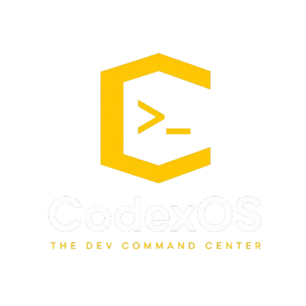

<div align="center">
  
  
  # CodexOS

  **The Ultimate Offline Developer OS & Native Control Center**  
  A blazingly fast, deeply integrated system explorer built on Rust, Tauri 2.0, and React 19.

  [](https://github.com/CodeSorcerer-007/CodexOS/releases)
  [](#)
  [](#)
  [](#)
  [](#)
  [](#)
  [](#)
</div>

<br/>

**CodexOS** is a next-generation desktop developer environment and system control center engineered from the ground up for speed, local privacy, and deep native OS capabilities. Bypassing Electron's memory bloat in favor of **Tauri 2.0 (Rust)**, CodexOS combines native system performance with a glassmorphic React 19 interface.

> [!NOTE]
> **100% Offline-First & Cross-Platform:** CodexOS runs entirely locally on Windows, macOS, and Linux. No forced cloud accounts, no telemetry, and zero mandatory network calls.

---

## 📑 Table of Contents

- [🚀 Feature Arsenal](#-feature-arsenal)
- [✨ AI Root-Cause Copilot](#-ai-root-cause-copilot)
- [🛠️ Tech Stack](#️-tech-stack)
- [🏗️ System Architecture](#️-system-architecture)
- [⚡ Quick Installation](#-quick-installation)
- [⚙️ Building from Source](#️-building-from-source)
- [📜 Creator Commit Log & Contributing](#-creator-commit-log--contributing)
- [📁 Project Structure](#-project-structure)
- [🔒 Security & Privacy Guarantees](#-security--privacy-guarantees)
- [📄 License](#-license)

---

## 🚀 Feature Arsenal

CodexOS is packed with high-performance native modules running locally on your hardware:

### 🗂️ Core File & System Management
| Module | Description |
|---|---|
| 🗂️ **File Vault** | High-performance file explorer with Microsoft Fluent UI icons, quick access pinning, git status overlays, bulk regex renamer, duplicate finder, and disk treemap visualizer. |
| 🔀 **Visual Git Client** | Full offline Git client featuring interactive branch graphs, staging, commit history, diff viewer, stash manager, clone, and remote sync. |
| 💻 **Terminal Multiplexer** | Concurrent multi-tab shell sessions powered by native Rust PTY bridges (`powershell.exe` on Windows, `/bin/bash` / `zsh` on Unix). |
| 📊 **Gridline UI & Modern Layout** | High-density card dashboard for immediate system telemetry, favorite directories, recent projects, and quick action execution. |
| ⚙️ **Process Manager** | Real-time system process monitor with CPU/RAM utilization telemetry, sorting, and safe process termination. |
| 📄 **Env Manager** | Workspace environment variable editor with `.env` syntax parsing, inline key encryption, and unencrypted export safety warnings. |
| 📡 **SSH Remote** | Secure remote server file explorer and terminal manager built on native `ssh2` bindings with host key verification. |

### 🔐 Security & Networking
| Module | Description |
|---|---|
| 🔑 **Secrets Manager** | Encrypted in-memory secrets vault powered by ChaCha20-Poly1305 with run-with-secrets command injection. |
| 🛡️ **HMAC / ZKP Vault** | Cryptographically signed key-value vault using HMAC-SHA256 zero-knowledge proof verification. |
| 🌐 **Proxy Interceptor** | Local HTTP/TCP traffic sniffer, debugger, and request replay engine built on hyper. |
| 🚇 **Port Tunnel** | Secure local port forwarding and reverse proxy tunneling powered by serveo. |

### 🛠️ Developer Tooling & Diagnostics
| Module | Description |
|---|---|
| 🐳 **Docker Dashboard** | Local Docker container, image, and network manager with real-time log tailing and container lifecycle controls. |
| 🗄️ **Database Studio** | SQLite visual manager with schema inspection, query execution, and tabular results analyzer. |
| ⚡ **Local AI Copilot** | Offline LLM assistant connecting directly to local Ollama instances — zero API keys and zero telemetry. |
| ✨ **AI Root-Cause Copilot** | Autonomous error diagnosis system diagnosing terminal errors, memory spikes, and HTTP failures via Mistral AI. |
| 🖥️ **GPU Cluster** | Real-time GPU utilization, VRAM metrics, and hardware telemetry tracking. |
| 🧠 **Memory Profiler** | Live process memory delta tracking and resource leak detection. |
| 🔭 **AST Refactor Engine** | Semantic code refactoring and syntax tree explorer powered by WebAssembly Tree-sitter. |
| 🤝 **CRDT Collab Editor** | Conflict-free peer-to-peer real-time code editor built on Yjs, WebRTC, and Monaco Editor. |
| 📦 **WASM Sandbox (Nano-VMs)** | Sandboxed WASM/WASI plugin execution engine powered by Wasmtime. |
| 🔌 **Plugin Manager & Marketplace** | Modular plugin runner and community plugin discovery hub. |
| 🤖 **Automation Studio** | Visual node-based workflow builder (ReactFlow) for automating routine developer tasks. |
| 📚 **DevDocs Viewer** | Instant offline documentation browser for languages, frameworks, and APIs. |

---

## ✨ AI Root-Cause Copilot

> [!IMPORTANT]
> **Autonomous Diagnosis** — The AI Root-Cause Copilot diagnoses issues across your entire dev environment using **Mistral AI** (`mistral-large-latest`). It is completely opt-in, silent without an API key, and stores keys exclusively inside Rust's encrypted vault.

```
Terminal Exit ≠ 0 ──┐
Memory Spike Delta  ──┼──► Rust Context Gatherer ──► Mistral API ──► Dismissible Diagnosis Card
HTTP 4xx / 5xx Error──┘
```

### Key Capabilities
- 🔴 **Automatic Detection**: Captures terminal stdout/stderr, git diffs (≤8KB), system metrics, or HTTP traces.
- 🏷️ **Confidence Metrics**: High / Medium / Low confidence ratings with transparent explanations.
- 💊 **Actionable Fixes**: Exact shell commands and code snippets formatted for immediate copy or review.
- 📁 **File Navigation**: Interactive file badges linking straight to the problematic source line.

---

## 🛠️ Tech Stack

### Frontend
| Technology | Version | Purpose |
|---|---|---|
| **React** | 19 | Declarative UI framework |
| **Vite** | 8 | Blazing fast build tooling & HMR |
| **TypeScript** | 6.0 | Strict type safety across the entire application |
| **Zustand** | 5 | Modular domain slices state management |
| **Framer Motion** | 12 | Fluid animations and glassmorphic modal transitions |
| **Tailwind CSS** | 4 | Modern utility-first styling |
| **Monaco Editor** | 0.56 | High-performance code editor |
| **Fluent UI Icons** | 2.0 | Standardized file & directory system iconography |
| **ReactFlow** | 12 | Interactive node-based automation graphs |
| **Recharts** | 3 | Real-time hardware telemetry and treemap visualization |
| **Yjs + WebRTC** | 13 / 10 | Real-time CRDT peer-to-peer collaboration |
| **xterm.js** | 6 | Full terminal emulation with ANSI color support |

### Backend (Rust / Tauri 2.0)
| Crate | Purpose |
|---|---|
| **Tauri 2.0** | Secure native application shell & capability-based IPC bridge |
| **portable-pty** | Cross-platform native PTY session manager |
| **git2** | Native libgit2 bindings for high-speed offline git operations |
| **rusqlite** | SQLite persistence for database studio & local KV storage |
| **sysinfo** | Real-time CPU, RAM, disk, and process telemetry |
| **wasmtime** | Sandboxed WASM / WASI plugin execution engine |
| **ring / chacha20poly1305** | Authenticated encryption and HMAC proof cryptography |
| **hyper / tokio** | Async HTTP proxy interceptor and network stream listener |
| **reqwest** | Async HTTP client for AI Copilot diagnostics |

---

## 🏗️ System Architecture

- **Multi-Tab Workspace**: Run up to 8 concurrent workspace tabs (`Ctrl+1..8`) with isolated state and persistence.
- **Lazy-Loaded Modules**: Every tool is dynamically imported via `React.lazy` + `Suspense`, maintaining sub-100ms startup.
- **Resilient UI Boundaries**: Global React Error Boundaries isolate crashes so individual modules never take down the app.
- **Typed Rust IPC**: All filesystem, git, networking, and crypto operations execute in Rust with type-safe Tauri 2 `invoke` handlers.

---

## ⚡ Quick Installation

Pre-built binaries are available for all major platforms:

### Option 1: Direct Download
Download the latest pre-compiled installers from [GitHub Releases](https://github.com/CodeSorcerer-007/CodexOS/releases/latest):
- 🪟 **[Windows (.msi / .exe)](https://github.com/CodeSorcerer-007/CodexOS/releases/latest)**
- 🍏 **[macOS (.dmg / .app)](https://github.com/CodeSorcerer-007/CodexOS/releases/latest)**
- 🐧 **[Linux (.AppImage / .deb)](https://github.com/CodeSorcerer-007/CodexOS/releases/latest)**

### Option 2: Windows Package Manager (`winget`)
```powershell
winget install CodeSorcerer.CodexOS
```

### Option 3: One-Click PowerShell Installer
```powershell
iwr -useb https://raw.githubusercontent.com/CodeSorcerer-007/CodexOS/main/install.ps1 | iex
```

---

## ⚙️ Building from Source

### Prerequisites
- [Rust](https://rustup.rs/) (latest stable toolchain)
- [Node.js](https://nodejs.org/) (version 20 or higher)
- Windows MSVC Build Tools (Visual Studio Build Tools 2022) or standard Unix build essentials

### Clone & Run
```bash
# 1. Clone the repository
git clone https://github.com/CodeSorcerer-007/CodexOS.git
cd CodexOS

# 2. Install dependencies
npm install

# 3. Launch Tauri dev server (Frontend + Rust backend with hot-reload)
npm run tauri dev
```

### Development & Quality Checks
```bash
# Run lightning-fast linter (oxlint)
npm run lint

# Run frontend test suite (Vitest)
npm test

# Run TypeScript typecheck
npx tsc --noEmit

# Run Rust backend unit & integration tests
cd src-tauri && cargo test

# Build production installer
npm run tauri build
```

---

## 📜 Creator Commit Log & Contributing

We love contributions! CodexOS features a dedicated **Creator & Contributor Commit Log** where creators can publicly log and document their commit messages, PRs, and feature implementations.

- 📝 **[View & Add to the Commit Log (COMMIT_LOG.md)](./COMMIT_LOG.md)**
- 🤝 **[Read Contribution Guidelines (CONTRIBUTING.md)](./CONTRIBUTING.md)**
- 🏛️ **[Review System Architecture (ARCHITECTURE.md)](./ARCHITECTURE.md)**

### How Creators Can Mention Their Commits:
1. Submit your PR following [Conventional Commits](https://www.conventionalcommits.org/).
2. Add your commit entry to the top of the table in [`COMMIT_LOG.md`](./COMMIT_LOG.md).
3. Include your GitHub handle, module scope, commit hash/PR link, and a concise summary.

---

## 📁 Project Structure

```
CodexOS/
├── src/                          # React 19 Frontend
│   ├── App.tsx                   # App shell, tab manager, shortcut listeners
│   ├── components/               # Core feature modules (lazy-loaded)
│   │   ├── FileGrid.tsx          # Native file vault with Fluent UI icons
│   │   ├── VisualGit.tsx         # Offline visual Git client
│   │   ├── TerminalMultiplexer.tsx # Multi-session PTY terminal
│   │   ├── SecretsManager.tsx    # ChaCha20-Poly1305 encrypted vault
│   │   ├── HMACVault.tsx         # HMAC-SHA256 proof vault
│   │   ├── DockerDashboard.tsx   # Container & image manager
│   │   ├── DatabaseStudio.tsx    # SQLite query studio
│   │   ├── NetworkInterceptor.tsx# HTTP/TCP proxy debugger
│   │   ├── CollaborativeEditor.tsx # Yjs + WebRTC peer editor
│   │   ├── LocalAI.tsx           # Ollama local LLM interface
│   │   ├── ASTRefactor.tsx       # Tree-sitter semantic refactoring
│   │   ├── GPUCluster.tsx        # GPU utilization monitor
│   │   ├── MemoryProfiler.tsx    # Process memory delta analyzer
│   │   ├── ProcessManager.tsx    # System process monitor & manager
│   │   ├── EnvManager.tsx        # .env workspace manager
│   │   ├── SshManager.tsx        # Remote SSH file & session manager
│   │   ├── PortTunnel.tsx        # Serveo port forwarding
│   │   ├── DiagnosisCard.tsx     # AI Root-Cause Copilot overlay
│   │   └── SettingsPage.tsx      # System & AI Copilot configurations
│   ├── gridline-dashboard/       # Modern high-density dashboard UI
│   ├── store/                    # Zustand modular state slices
│   ├── hooks/                    # Reusable hooks (keyboard shortcuts, PTY)
│   └── lib/                      # Shared frontend utilities
├── src-tauri/                    # Rust 2.0 Backend
│   ├── src/
│   │   ├── lib.rs                # App entrypoint & Tauri command registry
│   │   ├── files.rs              # High-speed filesystem operations
│   │   ├── git.rs                # Libgit2 bindings
│   │   ├── multiplexer.rs        # PTY session management
│   │   ├── secrets.rs            # In-memory ChaCha20 encrypted vault
│   │   ├── hmac_vault.rs         # HMAC commitment proof vault
│   │   ├── proxy.rs              # Async HTTP/TCP proxy engine
│   │   ├── kv.rs                 # Decoupled SQLite key-value persistence
│   │   ├── ai.rs                 # AI Copilot + Ollama integration
│   │   ├── sys.rs / system_tools.rs # System telemetry & process tools
│   │   ├── docker.rs             # Docker engine socket bridge
│   │   ├── db.rs                 # SQLite runner
│   │   ├── ssh.rs                # SSH2 remote filesystem client
│   │   ├── tunnel.rs             # SSH reverse tunneling
│   │   └── plugin.rs             # Wasmtime sandboxed runner
│   └── Cargo.toml
├── docs/                         # Extended API & IPC reference documentation
├── COMMIT_LOG.md                 # 📜 Creator & contributor commit log
├── CONTRIBUTING.md               # Contribution standards and guidelines
├── ARCHITECTURE.md               # Deep architectural documentation
└── package.json
```

---

## 🔒 Security & Privacy Guarantees

- 🛡️ **100% Local Execution**: Your data, files, credentials, and code never leave your machine.
- 🔐 **Isolated AI Keys**: `MISTRAL_API_KEY` is stored exclusively in the ChaCha20-Poly1305 vault inside the Rust memory space and is never exposed to JavaScript.
- 📦 **Sandboxed Extensions**: WASM plugins run strictly inside Wasmtime sandboxes with zero host permissions by default.
- 🛡️ **Strict Content Security**: Hardened CSP prevents unauthorized remote scripts and untrusted network origins.

---

## 📄 License

CodexOS is open-source software licensed under the [MIT License](./LICENSE).

<div align="center">
  <br/>
  <b>Built for developers who value speed, privacy, and control.</b>
</div>
